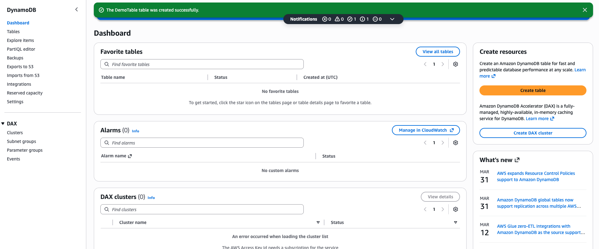
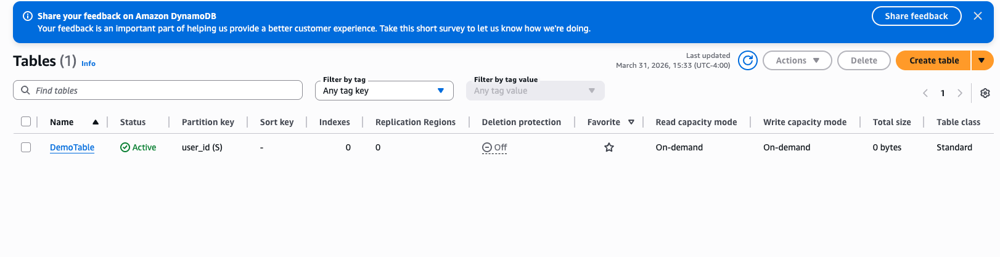
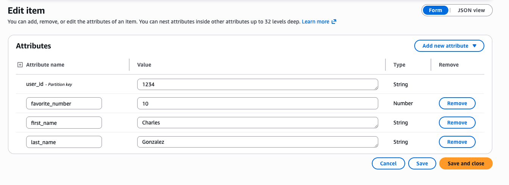
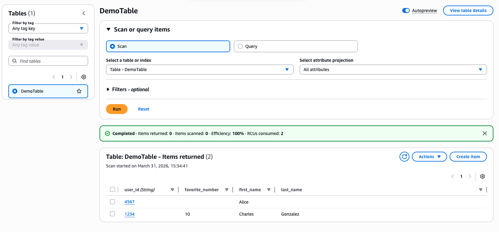

# DynamoDB Basics Lab

## What I Did
I created and worked with a DynamoDB table in AWS to understand how cloud databases store and manage data.

## Steps
1. Opened DynamoDB in AWS
2. Created a new table
3. Defined a primary key
4. Added sample items to the table
5. Reviewed how data is stored and accessed

## What I Learned
- DynamoDB is a NoSQL database in AWS
- Tables store data using items and attributes
- A primary key helps identify each record
- DynamoDB is useful for modern cloud applications

## Tools Used
- AWS DynamoDB

## Notes
This lab helped me understand the basics of cloud databases and how AWS stores structured data.

## Screenshots

### DynamoDB Dashboard

### Table Created

### Table Items

### Table Overview

