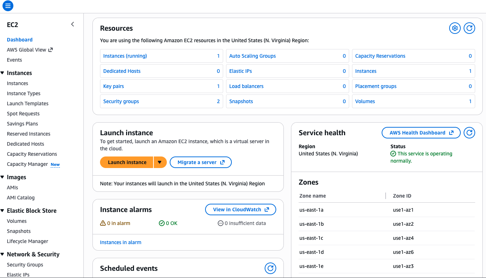
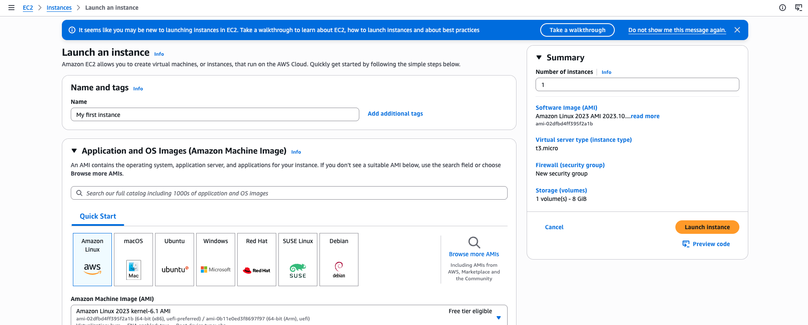
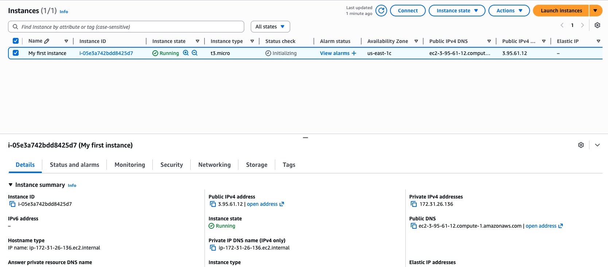
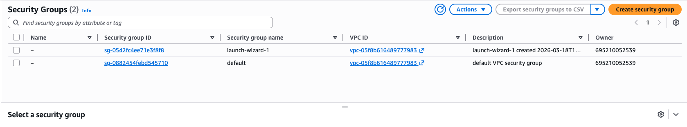
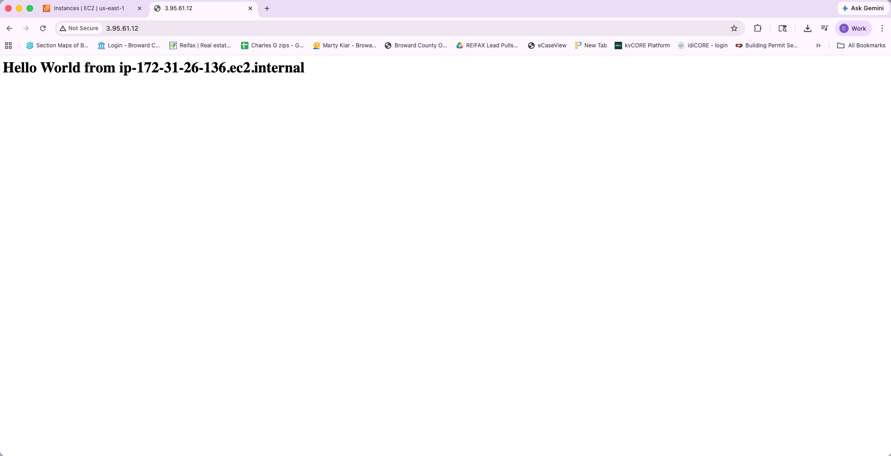

# EC2 Launch Instance Lab

## What I Did
I launched a virtual server (EC2 instance) in AWS and connected to it.

## Steps
1. Went to EC2 dashboard
2. Clicked "Launch Instance"
3. Chose Amazon Linux AMI
4. Selected instance type (t2.micro)
5. Created a key pair
6. Configured security group (allowed SSH)
7. Launched the instance
8. Connected to the instance using EC2 connect

## What I Learned
- EC2 is a virtual server in AWS
- Key pairs are used for secure access
- Security groups act like a firewall
- You can connect to your server directly from the browser

## Tools Used
- AWS EC2

## Notes
This lab helped me understand how to create and access a cloud server.

## Screenshots

### EC2 Dashboard

### Launch Configuration

### Instance Running

### Security Group

### Connected to Instance

