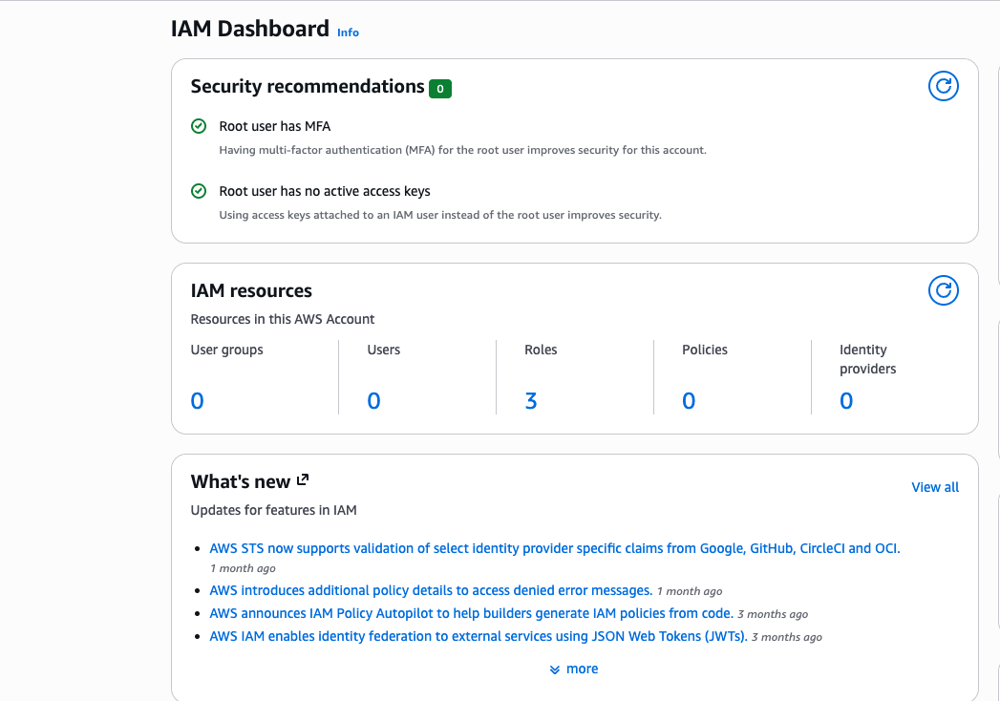
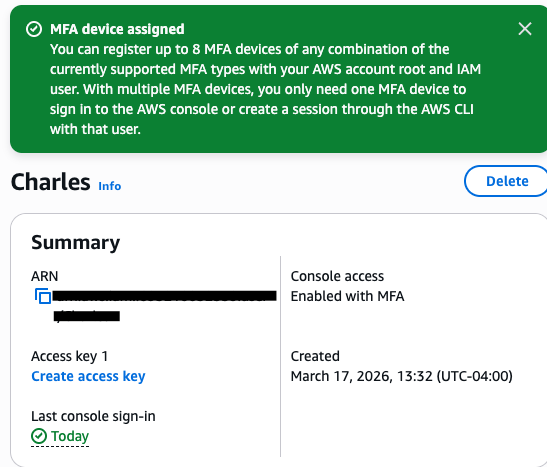
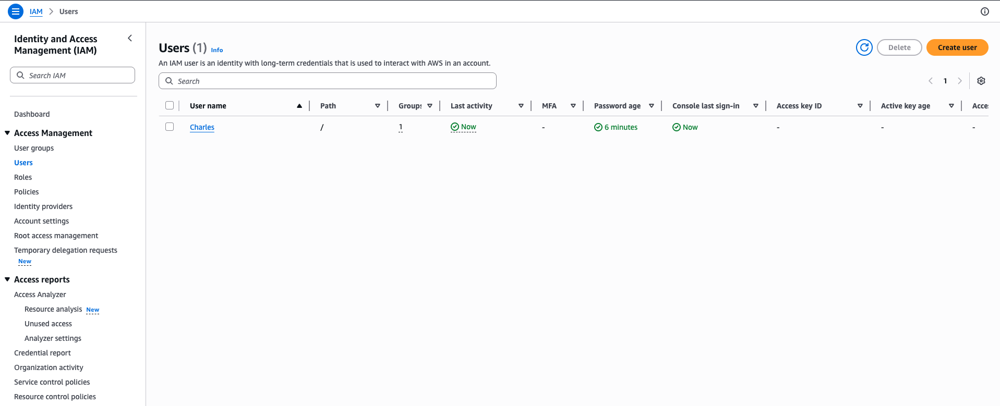
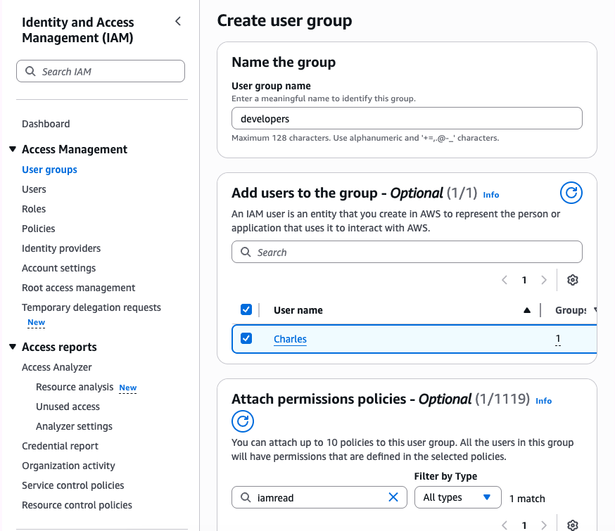
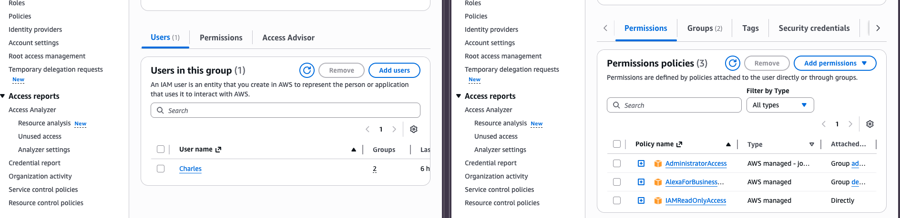
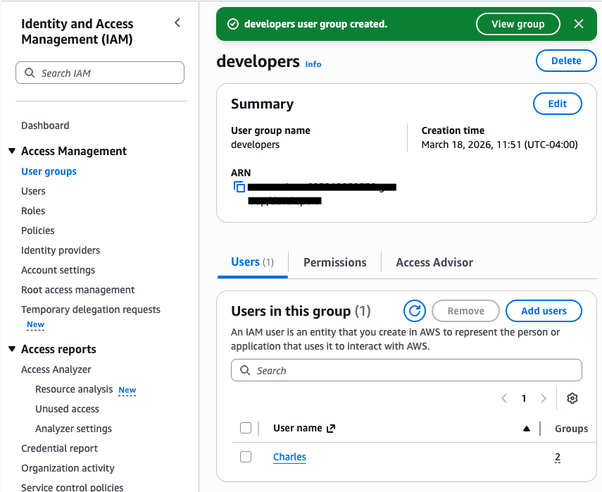

# IAM Users and Groups Lab

## What I Did
I created IAM users and groups in AWS and assigned permissions.

## Steps
1. Went to IAM dashboard
2. Added additional an MFA key
3. Created a new user
4. Created a group
5. Assigned permissions to the group
6. Added user to the group

## What I Learned
- IAM controls access in AWS
- Groups make permission management easier
- Security is very important in AWS

## Tools Used
- AWS IAM

## Notes
This lab helped me understand how AWS handles users and permissions.

## Screenshots

### IAM Dashboard

### MFA Key Created

### User Created

### Group Created

### Permissions

### User in Group

