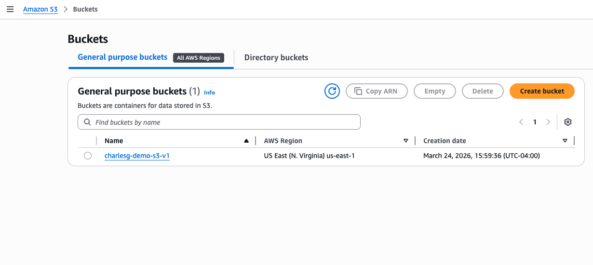
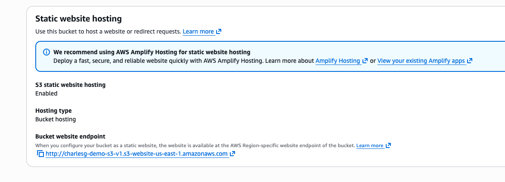
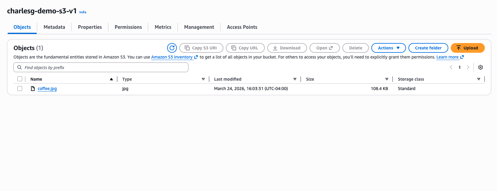
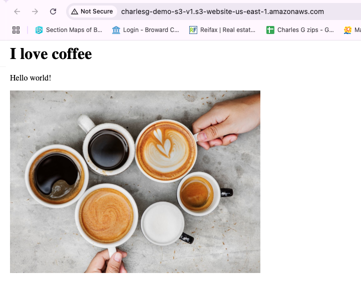

# S3 Static Website Lab

## What I Did
I created a static website using AWS S3 and made it publicly accessible.

## Steps
1. Created an S3 bucket
2. Enabled static website hosting
3. Uploaded HTML file
4. Configured bucket permissions
5. Accessed the website using the S3 endpoint

## What I Learned
- S3 can host websites
- Buckets store files in AWS
- Permissions control public access

## Tools Used
- AWS S3

## Notes
This lab helped me understand how cloud storage can be used to host a simple website.

## Screenshots

### Bucket Created

### Static Hosting Enabled

### Files Uploaded

### Live Website

