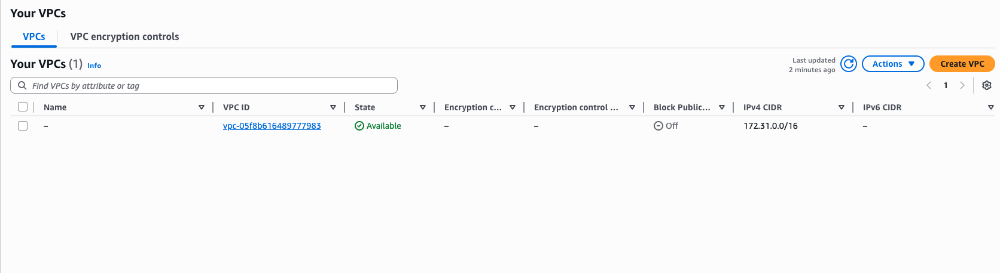
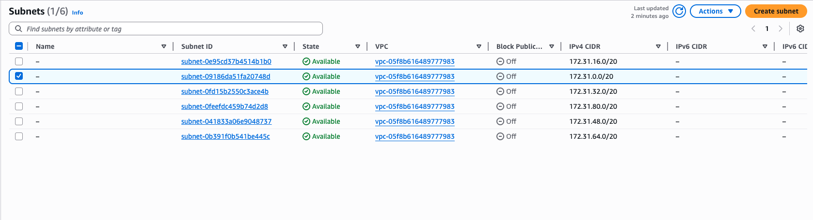
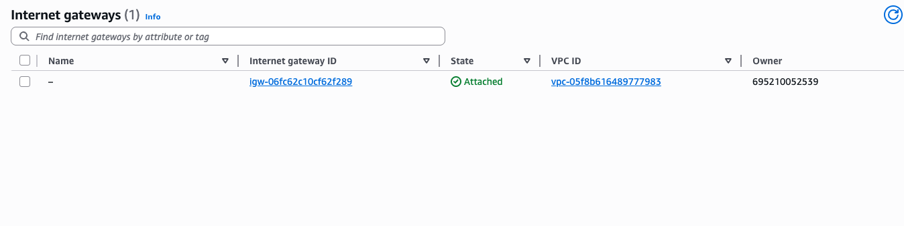
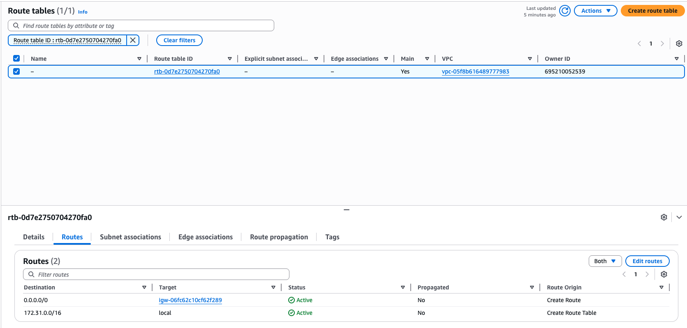
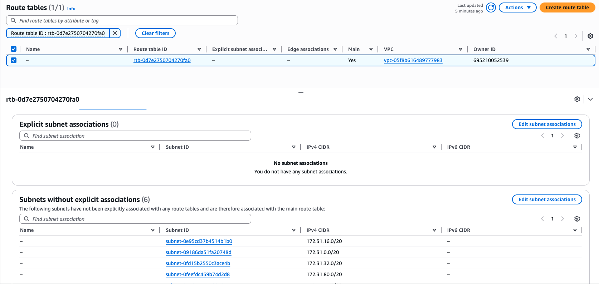

# VPC Basics Lab

## What I Did
I created a basic Virtual Private Cloud (VPC) with a public subnet and configured internet access.

## Steps
1. Created a VPC
2. Created a public subnet
3. Created an Internet Gateway
4. Attached the Internet Gateway to the VPC
5. Created a route table
6. Added a route to allow internet access
7. Associated the subnet with the route table

## What I Learned
- A VPC is a private network in AWS
- Subnets divide the network
- Internet Gateway allows access to the internet
- Route tables control traffic flow

## Tools Used
- AWS VPC

## Notes
This lab helped me understand the basic networking structure in AWS.

## Screenshots

### VPC Created

### Subnet Created

### Internet Gateway Attached

### Route Table Configuration

### Subnet Association

